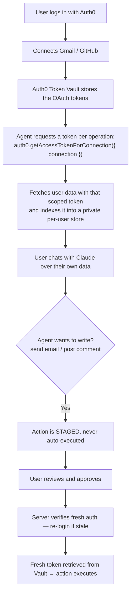

# Sanctum — Authorized Agentic RAG

> Your AI agent. Your data. Your rules.

**Live demo:** [agent-vault-psi.vercel.app](https://agent-vault-psi.vercel.app)

Sanctum is a personal AI agent that reads your Gmail and GitHub — and can act on them — using **Auth0 Token Vault** as the identity layer. The agent never stores your credentials. Every write action is staged for review and requires step-up authentication before it executes.

Built for the [Auth0 "Authorized to Act" Hackathon](https://auth0hackathon.devpost.com/).

## The core idea

Most personal AI assistants require you to hand over your OAuth tokens. Sanctum flips this: **the agent holds no credentials**. It requests a scoped token on-demand from Auth0 Token Vault, uses it for exactly one operation, and discards it.



## Features

- **Authenticated RAG** — data fetched with real Token Vault tokens, embedded locally with `all-MiniLM-L6-v2`, retrieved by cosine similarity
- **Per-user isolated stores** — each user's index is keyed by their Auth0 ID; no cross-user leakage
- **Staged write actions** — the agent proposes; the user approves; step-up auth (re-authentication within 5 minutes, enforced via the OIDC `auth_time` claim and `max_age=0`) gates execution
- **Permission dashboard** — connect and revoke services, see granted scopes
- **Audit log** — every index, staged action, approval, denial, and revocation is recorded per user

## Tech stack

| Layer | Tech |
|---|---|
| Framework | Next.js 16 (App Router) |
| Auth + Token Vault | Auth0 `@auth0/nextjs-auth0` v4 |
| AI reasoning | Anthropic Claude via `@anthropic-ai/sdk` |
| Embeddings | `@xenova/transformers` with `all-MiniLM-L6-v2` (runs locally, no API key) |
| Styling | Tailwind CSS v4 + Lucide icons |
| Retrieval store | In-memory per-user store |

## Setup

### 1. Install

```bash
npm install
```

### 2. Configure Auth0

Follow **[AUTH0_SETUP.md](./AUTH0_SETUP.md)**.

### 3. Set environment variables

```env
AUTH0_SECRET='<32-byte random string>'
AUTH0_BASE_URL='http://localhost:3000'
AUTH0_DOMAIN='your-tenant.auth0.com'
AUTH0_CLIENT_ID='your-client-id'
AUTH0_CLIENT_SECRET='your-client-secret'

AUTH0_MGMT_CLIENT_ID='your-mgmt-client-id'
AUTH0_MGMT_CLIENT_SECRET='your-mgmt-client-secret'

ANTHROPIC_API_KEY='your-anthropic-api-key'
ANTHROPIC_MODEL='claude-sonnet-4-0' # optional
```

### 4. Run

```bash
npm run dev
```

Open `http://localhost:3000`.

## How Token Vault is used

The key Auth0 SDK call lives in [`src/lib/tokenVault.ts`](./src/lib/tokenVault.ts):

```ts
const tokenResult = await auth0.getAccessTokenForConnection({
  connection: 'google-oauth2',
});

const res = await fetch('https://gmail.googleapis.com/gmail/v1/users/me/messages', {
  headers: { Authorization: `Bearer ${tokenResult.token}` },
});
```

Token Vault handles:

- Storing federated OAuth tokens after a user connects a service
- Refreshing tokens before they expire
- Returning no token when the user has not connected that service
- Keeping credentials out of the application entirely

Write actions retrieve a fresh token from Token Vault only at execution time, after the user has approved the action with a fresh session.

## Security model

| Action | Agent permission |
|---|---|
| Read Gmail inbox | Allowed with Token Vault token |
| Read GitHub issues | Allowed with Token Vault token |
| Send email | Staged → user approval + step-up auth |
| Post GitHub comment | Staged → user approval + step-up auth |
| Store OAuth tokens | Never — handled entirely by Auth0 Token Vault |

The step-up flow ([`src/app/api/approve/route.ts`](./src/app/api/approve/route.ts)):

1. Agent stages the action — it never executes autonomously
2. User reviews and clicks Approve
3. Server checks the OIDC `auth_time` claim; if authentication is older than 5 minutes, it returns 403 with a forced re-login URL (`max_age=0`)
4. User re-authenticates and approves again
5. Server retrieves a fresh Token Vault token and executes the action, logging the result to the audit trail

## Project structure

```text
src/
├── app/
│   ├── api/
│   │   ├── approve/      # Execute or deny staged write actions (step-up gated)
│   │   ├── audit/        # Fetch per-user activity log
│   │   ├── auth/[auth0]/ # Auth0 route handler (login, callback, connect)
│   │   ├── chat/         # Chat endpoint (RAG + Claude)
│   │   ├── index-data/   # Trigger indexing via Token Vault
│   │   ├── permissions/  # List connected services and scopes
│   │   └── revoke/       # Unlink a connected service
│   ├── chat/             # Chat interface
│   ├── dashboard/        # Permission dashboard
│   └── page.tsx          # Landing page
├── components/
│   └── Sidebar.tsx
├── lib/
│   ├── audit.ts          # Per-user audit log
│   ├── auth0.ts          # Auth0 client + Management API token
│   ├── rag.ts            # Indexing, embedding, retrieval, agent loop
│   └── tokenVault.ts     # Token Vault operations
└── proxy.ts              # Auth middleware / route protection
```

## Known limitations (prototype scope)

- The retrieval store, audit log, and pending-action queue are in-memory — they reset on redeploy and assume a single instance. Production would use per-user namespaces in Redis/Pinecone and an append-only audit store.
- Indexing covers recent important Gmail messages and assigned GitHub issues; it is a demonstration of the authorization pattern, not an exhaustive sync.
- Staged actions execute the LLM-proposed parameters as approved; a hardened version would render the full parameters (not just the description) in the approval UI and validate them server-side.

## License

MIT
